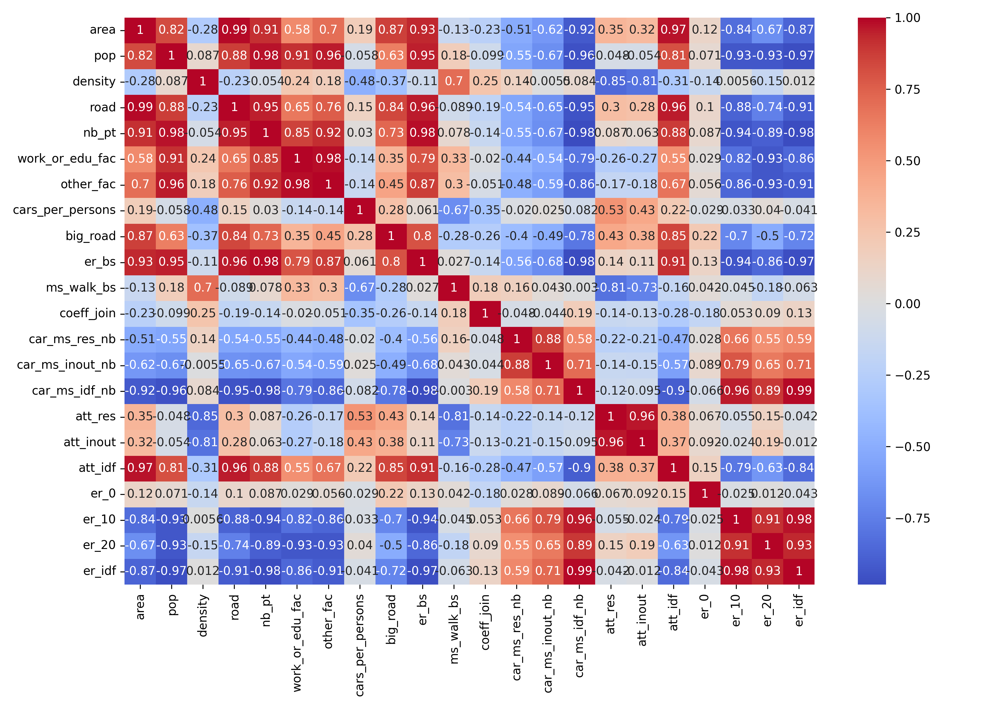
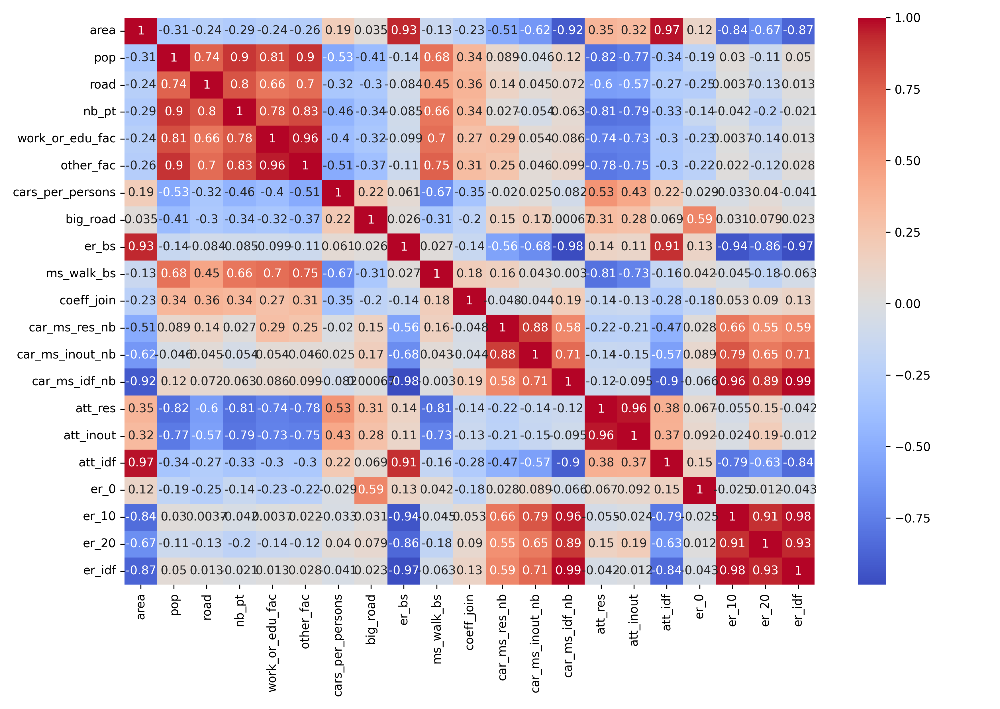
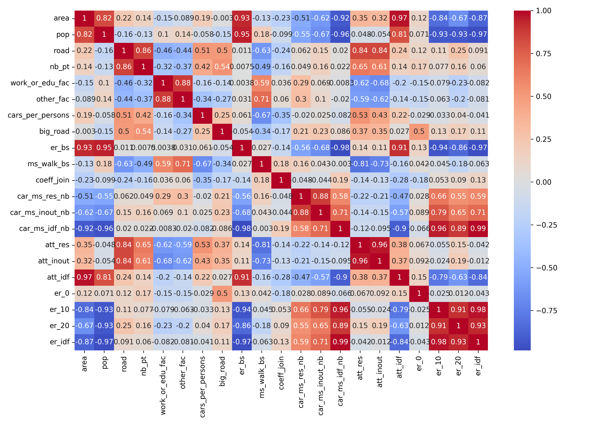

# Quelques analyses statistiques sur les entrées et sorties

## Graphes disponibles

Dans all_graphes on trouve les graphes de toutes les combinaisons d'entrées et sorties possibles.

Chaque image regroupe un ensemble de graphes. 

Chaque image représente les relations des entrées ou des sorties avec une entréee ou sortie en particulier.

### Nom des graphes

Le nom des images est toujours construit de la même manière : a_with_b.png.

a représentes les ordonnées et b les abcisses.

Par exemple results_with_pop.png va contenir les graphes de chaque sortie en fonction de la population.

### Légendes

Certains graphes n'ont pas de légende par manque de place.

Tout les graphes partagent la même légende et elle peut donc être trouvée sur d'autres graphes.

### div_area_graphes et div_pop_graphes

Le dossier div_area_graphes contient les même graphes que all_graphes sauf que la plupart des entrées ont été remplacées par leur densité.

Le dossier div_pop_graphes contient les même graphes que all_graphes sauf que la plupart des entrées ont été remplacées par leur valeur par habitants.

## Analyses sur les graphes

### Matrice de corrélation

On peut voir que la plupart des sorties sont fortement corrélées à l'aire, sauf le gain de temps de trajet pour les résidents et les utilisateurs, ainsi que le gain d'émissions de CO2 dans la drz.
 
Les temps de trajets semblent être plutôt corrélés avec le nombre de voiture par personne et la densité de population.

La seule des entrées qui est corrélée de manière non négligeable avec le gain d'émissions de CO2 dans la DRZ est le nombre de kilomètres d'autoroutes, ce qui était attendu.

La plupart des entrées sont trés fortement corrélées à l'aire et donc ensemble.

La matrice de corrélation avec les densité des entrées peut être aussi intéressante.

### Matrice de corrélation des densités

Les entrées ont été remplacées par leur densité sauf pour le nombre de voiture par personnes, la part modale de la marche dans le cas de base et le coefficient de jointure.

Les entrées qui étaient très fortement corrélées à l'aire ne le sont plus et donc ne sont plus corrélées aux même sorties.

Elles sont maintenant corrélées au gain du temps de trajet moyen. 

Les autres relations semblent rester les mêmes même si elles sont parfois accentuées.

Il pourrait être intéressant de réentraîner les modèles avec les entrées en densité.

### Matrice de corrélation avec certaines entrées divisées par la population

Les entrées ont été remplacées par leur valeur par habitant sauf pour le nombre de voiture par personnes, la part modale de la marche dans le cas de base et le coefficient de jointure.

Les entrées sont beaucoup moins corrélées entre elles et chaque sortie est clairement corrélée à un petit groupe d'entrées.

Il pourrait être intéressant de réentraîner les modèles avec les entrées en valeur par habitants.

Si in rénetraîne la régression linéaire par exemple, on a une meilleure MAE et un meilleure R2 sur les entraînement avec tout le corpus.

## Graphes de relations entre les entrées et sorties

### Gain d'émissions de CO2 sur l'île de France en fonction du gain de temps de trajet moyen sur l'île de France

Ce graphe nous permet de calculer le coût qu'a la réduction des émissions et semble montrer qu'il existe un optimum à viser (ligne noire).

L'optimum à été dessiné à la main, son équation est y = 7/3 + (13/3)*x.

### Gain d'émissions de CO2 sur l'île de France en fonction de l'aire de la DRZ

On peut voir qu'il y a une relation entre l'aire de la DRZ et le gain d'émissions de CO2 en île de France. Cette relation confirme ce que l'on a observé sur la matrice de corrélation.

Néanmoins ce gain n'est pas strictement linéaire, pour une même aire il y a plusieurs gains d'émissions possibles.

### Gain du temps de trajet moyen pour les résidents et les non-résidents en fonction de la densité de la DRZ

Ci-dessous le graphe du gain du temps de trajet moyen pour les résidents en fonction de la densité de la DRZ

On peut voir qu'il y a une relation entre temps de trajet moyen pour les résidents et la densité de la DRZ. Cette relation confirme ce que l'on a observé sur la matrice de corrélation.

Cette relation n'a pas l'air linéaire mais plutôt hyperbolique, cela confirme que chaque sortiie peut avoir des relations de nature différente avec les entrées et donc qu'il pourrait être intéressant d'entraîner un modèle différent pour chaque sortie.
