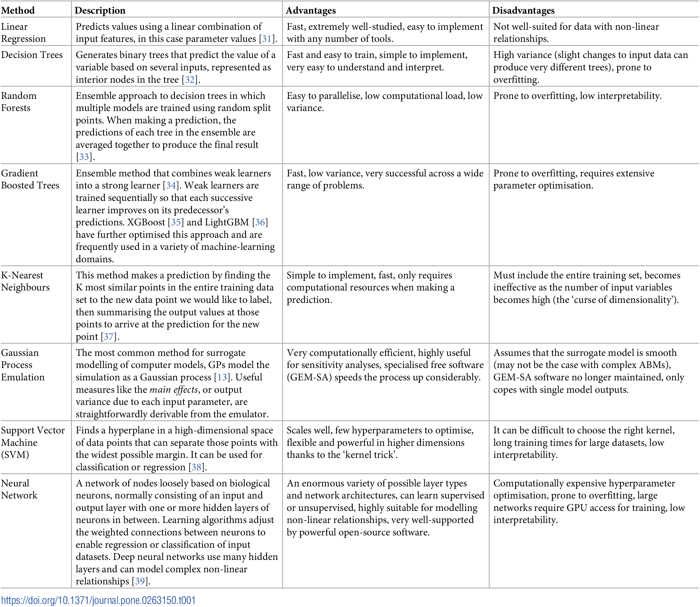
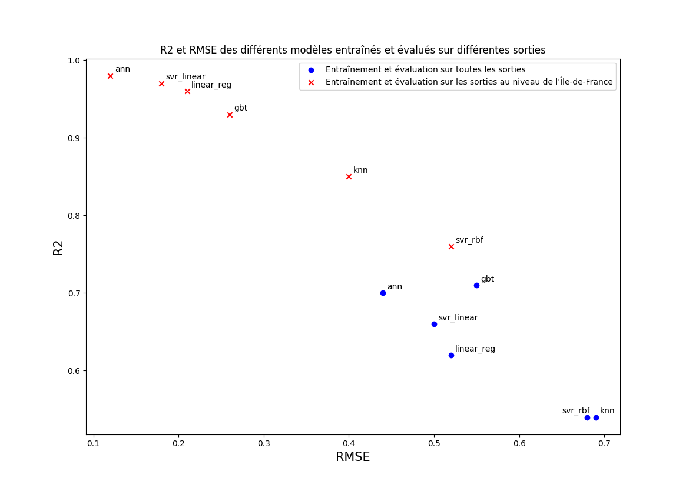

# Quelques infos sur les modèles mis en place

## Description, avantages et désavantages des modèles

https://doi.org/10.1371/journal.pone.0263150.t001 (from ANGIONE Claudio, SILVERMAN Eric et YANESKE Elisabeth. Using machine learning as a surrogate model for agent-based simulations. Plos one, 2022, vol. 17, no 2, p. e0263150.)

Les modèles qui nous intéressent sont : 
- Linear regression (linear_reg)
- Gradient Boosted Trees (gbt)
- K-Nearest Neighbours (knn)
- Support Vector Machine (svr...)
- Neural Network (ann)

## Commentaire du graphe 

On voit que les anns sont meilleurs pour les deux métriques et les deux choix de sorties.

On voit que le classement des modèles change entre les deux choix de sorties, ce qui appuie l'idée d'entraîner un modèle par sortie.

(Les résultats chiffrés complets avec rmse, mae et r2 sont dans le .csv et à la fin de ce document).

## Comment améliorer les modèles 
- plus de simulations amènera quasi-certainement à de meilleurs résultats pour tout les modèles, et permettrait de faire des corpus train/test/val réellement équilibrés
- tester d'autres découpages du corpus (en s'assurant que le test reste assez représentatif), on pourrait aussi essayer le x-fold training (cf. Tatiana)
- sélectionner les features pour les modèles hors anns (j'ai commencé mais j'avais toujours des résultatas moins bons) + étudier les conséquences de remplacer les données qui peuvent l'être par une densité (idem)
- entraîner chaque modèle sur un petit nombre de sorties (voire une seule), de plus comme on a peu de données ça ne prends pas trop de temps
- tester méthodes d'optimisation des hyperparamètres pour les anns (cf. conférence pendant le séminaire), jusque là j'ai plutôt tatonné

## Résultats exacts

| model | rmse_all | mae_all | r2_all | rmse_idf | mae_idf | r2_idf |
| --- | --- | --- | --- | --- | --- | --- |
| ann | 0.44 | 0.34 | 0.70 | 0.12 | 0.10 | 0.98 |
| linear_reg | 0.52 | 0.39 | 0.62 | 0.21 | 0.15 | 0.96 |
| gbt | 0.55 | 0.36 | 0.71 | 0.26 | 0.17 | 0.93 |
| knn | 0.69 | 0.48 | 0.54 | 0.40 | 0.27 | 0.85 |
| svr_poly | 1.27 | 0.69 | -0.46 | 1.41 | 0.56 | -0.73 | 
| svr_rbf | 0.68 | 0.45 | 0.54 | 0.52 | 0.27 | 0.76 |
| svr_linear | 0.50 | 0.37 | 0.66 | 0.18 | 0.13 | 0.97 |
| svr_sigmoid | 1.10 | 0.74 | -0.13 | 1.11 | 0.70 | -0.09 |

all -> sur toutes les sorties

idf -> seulement sur les sorties à l'échelle de l'île de France
